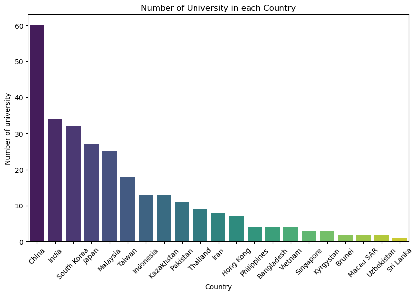
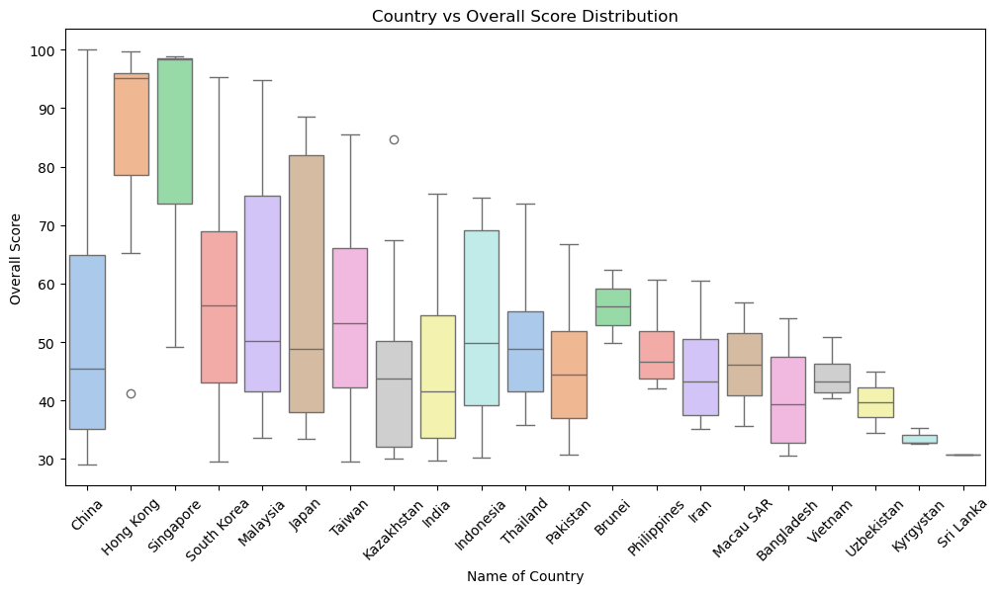
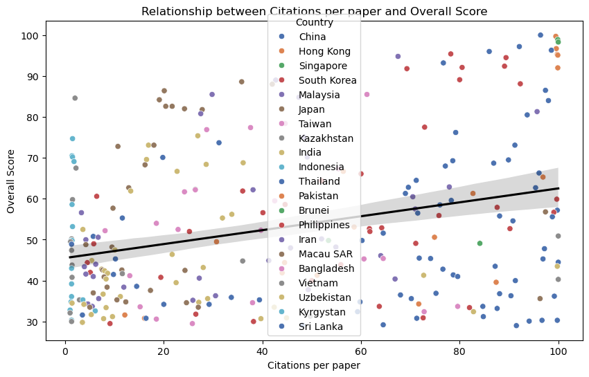
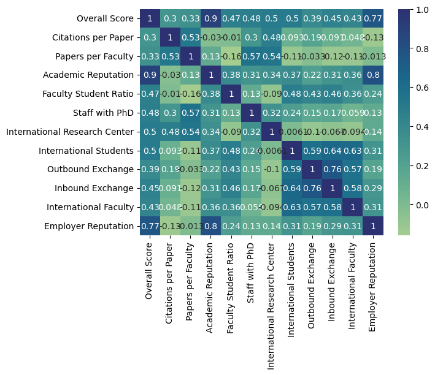

# QS University Rankings Analysis

This project analyzes the QS Asian University Rankings dataset to explore patterns, distributions, and key factors influencing university rankings across Asia.

## Objectives
- Identify countries with the most ranked universities
- Analyze score distributions
- Explore relationships between ranking metrics
- Examine factors that influence overall university performance

## Data Preparation
- Cleaned and handled missing values
- Standardized column formats for analysis
- Verified data consistency across ranking metrics

## Exloratory Data Analysis
- Countries with the Most Ranked Universities
- Score Distribution
- Correlation Analysis of the Relationships between Academic Reputation, Employer Reputation, Faculty/Student Ratio, Citations per Faculty

## Key Insights
- China has the highest number of ranked universities
- Academic reputation shows a strong correlation with overall university score
- Some universities perform well in employer reputation but have lower academic scores
- Score distribution is skewed toward mid-to-high range universities, with fewer extreme values
- Research-related metrics play a significant role in determining rankings

## Visualizations
- Bar chart (Top countries by number of universities)

- Box plot (Score distribution across countries)

- Scatter plot (Relationship between ranking factors)

- Correlation heatmap (Metric relationships)

## Tools Used
- Python
- Pandas
- Matplotlib
- Seaborn
- Jupyter Notebook

## Dataset
Source: Kaggle – [QS Asian University Rankings](https://www.kaggle.com/datasets/bilalabdulmalik/top-300-asian-universities-qs-rankings-2024)     
Original data from QS (Quacquarelli Symonds) Rangings 2024

## Credits
This project is based on a tutorial from [YouTube](https://youtu.be/ha4CHHJ7iNQ?si=fogYSFe9Vl9q3Fo4).
I followed the tutorial to understand the workflow and added my own improvements and explanations.
